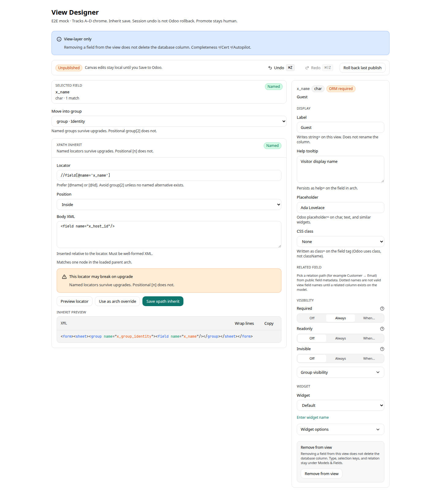
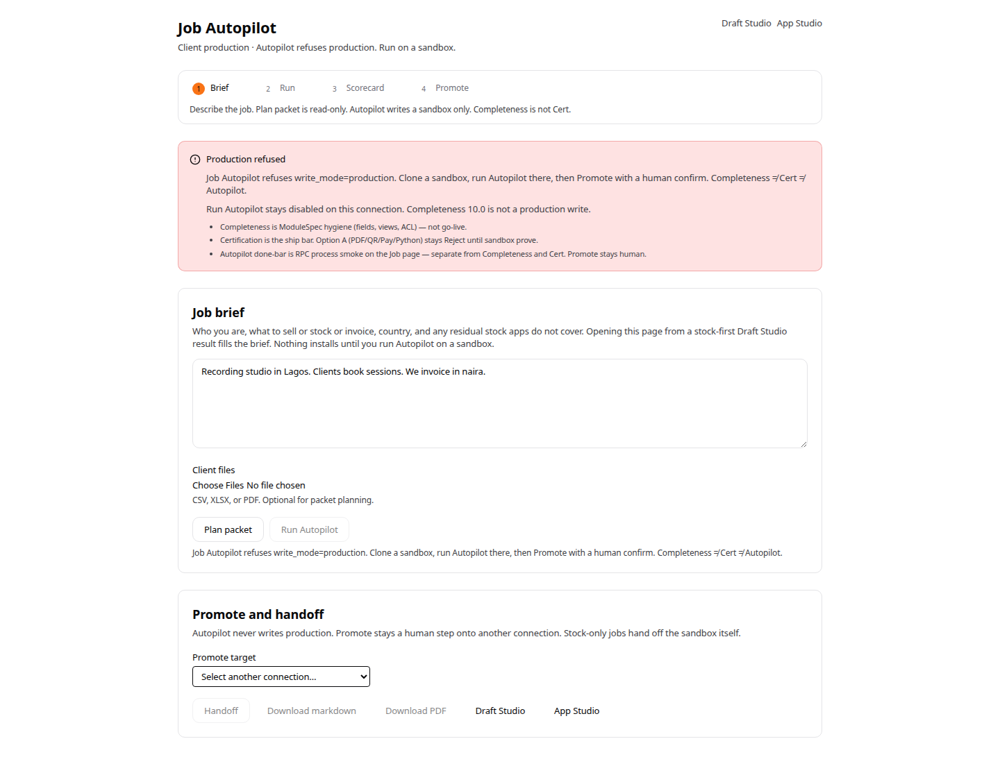
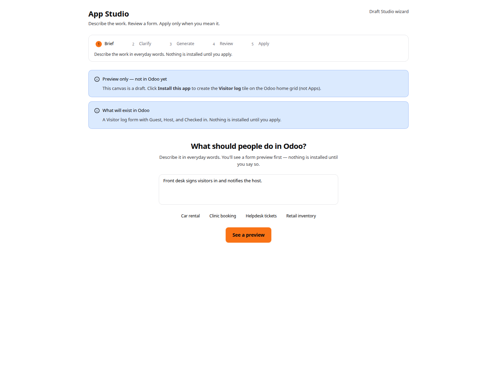
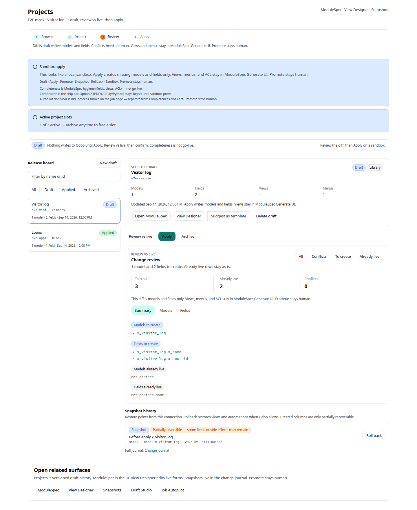
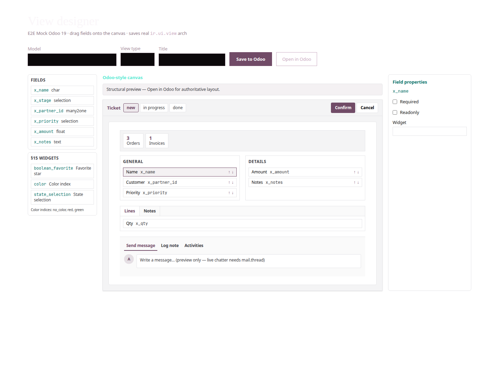

# Premium UX world-class UAT

**Date:** 2026-09-14  
**Tip:** `cursor/premium-odoo-expert-ux-77b3` @ `efda9a9`  
**Auditor:** chrome UAT on this Cloud Agent VM. **No live Odoo, no FastAPI, no app Postgres.**  
**Bar:** Linear / Figma properties / Intercom / Stripe Dashboard density — **not** Odoo Enterprise Studio cloning.  
**Clean-room:** public ORM/RPC chrome only. No Studio source.

## Executive summary

The PR chain **#3–#12** shipped a **coherent premium dialect** (list→composer, stage rails, honesty banners, Completeness ≠ Cert ≠ Autopilot, Promote stays human). That is real product work.

It is **not world-class**. Average surface score is **~3.3 / 5**. The strongest surface is **Odoo Expert (~4.1)**. The weakest is **View Designer production (~2.3)** — Tracks A–D exist as extracted parts inside a **5,739-line dump** with leftover mauve/near-black hex. Automations / Builder / Menus are **high mid-premium**. App Studio’s brief is Intercom-grade; Draft Studio is still a consultant worksheet with a stage rail glued on.

**Chrome UAT:** pass with findings. Operators can walk every surface’s chrome on `/e2e/*` harnesses (this PR).  
**Live RPC UAT:** **not run here.** Founder must repeat write paths on `:8069` (create model, inherit save, automation, apply, Autopilot refuse on production). Do not treat this report as RPC proof.

**Ready for founder live UAT?** **Yes, with blockers below.** Ready to market as Linear/Figma-class? **No.**

---

## P0 remediation (2026-09-14 follow-up)

PR off tip `cursor/premium-uat-world-class-595a`. **Not world-class complete.** Designer density is still a follow-up.

| Item | Status |
|---|---|
| Access “Apply live pack” confirm phrase | **Fixed.** API `POST …/access/multi-company/apply-live` returns 403 without `I understand the risks`. UI uses ConfirmDialogV2. Does not create a global `ir.rule` without confirmation. |
| Job Autopilot leave-and-return | **Fixed (resume).** `sessionStorage` job id is now read on return: running jobs resume polling; succeeded jobs open the last result; missing jobs show start-new copy. Progress copy no longer claims “the job keeps running” without resume. |
| Overview “Draft with AI” dual entry | **Fixed.** Primary CTA → App Studio (`/studio`). Draft Studio is secondary (`/wizard`). App Studio chrome says “Draft Studio”, not “Draft Studio wizard”. |
| Projects Apply gated on Review | **Fixed.** Apply stays disabled until Review vs live has produced a diff for the selected draft. |
| ModuleSpec → Projects | **Fixed.** Shell + handoff bar link Projects (`?project=` when a draft is loaded). |
| Designer inject/checkpoint contrast | **Partial.** Inject-strategy label uses `text-muted`; select and checkpoint rows already used `text-ink` on the tip. Remaining mauve hex (`#a8909e`) across the 5.7k dump is **open**. |
| Auto-promote implication copy | **No remaining “will auto-promote” copy found** on Job / Overview / Access / Projects. Expert already repeats never auto-promote. |

**Still open (not this PR):** extract View Designer `page.tsx` (~5.7k); Access matrix live CRUD confirm; Config Packet apply-target defaulting to self; Draft Studio Promote ConfirmDialog v1; App Studio gold/Accounting CTA; Expert destination cleanup.

---

## Scope honesty

| Layer | This run |
|---|---|
| Chrome / copy / hierarchy | Reviewed in source + rendered `/e2e/*` harnesses |
| Playwright / Vitest inventory | Counted; screenshot spec added |
| Live `ir.*` writes | **Not available** — no Odoo |
| Sandbox Autopilot executor | **Not available** |
| Visual screenshots | `docs/uat-premium/screenshots/` (chrome only) |

Tiny P0 polish shipped in this report PR (not a mega surface):

1. View Designer inject-strategy select and published-checkpoint labels used off-white text on light surface — **unreadable**. Reporting-view panel used near-black leftover chrome.
2. `/e2e/modulespec` and `/e2e/projects` were **ungated** (`NEXT_PUBLIC_E2E`); they now match Expert/kit.
3. Missing production-chrome harnesses added so UAT is not stuck on the stale purple `/e2e/designer` toy.

---

## Scorecard (1 = intern dump, 5 = Linear / Figma / Stripe)

| # | Surface | Visual | Interaction | Consistency | Safety honesty | Cross-links | Tests | Gaps (5=few) | **Overall** | Verdict |
|---|---|---:|---:|---:|---:|---:|---:|---:|---:|---|
| 1 | View Designer A–D | 2 | 2 | 2 | 4 | 2 | 3 | 2 | **2.4** | Mid-premium **parts** in a dump |
| 2 | Automations | 4 | 4 | 4 | 4 | 3 | 4 | 3 | **3.7** | High mid-premium |
| 3 | Models & Fields | 4 | 4 | 4 | 4 | 4 | 3 | 3 | **3.7** | High mid-premium; best list→composer |
| 4 | Menus & Access | 3 | 3 | 4 | 3 | 3 | 2 | 2 | **2.9** | Menus OK; Access confirm hole |
| 5 | App Studio | 4 | 4 | 3 | 4 | 3 | 3 | 3 | **3.4** | Elite brief, CBN-stained Option A |
| 6 | Draft Studio | 2 | 3 | 3 | 4 | 4 | 4 | 2 | **3.1** | Honesty > layout |
| 7 | Job Autopilot | 3 | 3 | 4 | 4 | 3 | 3 | 3 | **3.3** | Safety pass; interaction mid |
| 8 | ModuleSpec | 3 | 3 | 4 | 4 | 3 | 3 | 3 | **3.3** | JSON demoted; chrome dump |
| 9 | Projects | 4 | 3 | 4 | 3 | 4 | 3 | 3 | **3.4** | Best Linear-shaped board |
| 10 | Odoo Expert | 4 | 4 | 4 | 5 | 4 | 4 | 4 | **4.1** | Closest to Intercom |

**Chain average: 3.3 / 5.** Mid-premium product chrome with a locked honesty dialect. Not Stripe Dashboard.

---

## Per-surface notes

### 1. View Designer (Tracks A–D) — **2.4**

**Evidence:** `apps/web/src/app/connections/[id]/designer/page.tsx` is **5,739 LOC**. Automations is 694. Extracted A–D (`DesignerFieldInspector`, `OverlayEditor`, `DesignerSessionBar`, `XPathInheritPanel`) were left beside the old page.

- Dual form canvases (“Optional Odoo-style preview” vs primary Form layout).
- Overlay / Track D only mounts when iframe preview is on.
- Header still uses `#a8909e` mauve labels. Production tokens map `--odoo-primary` → petrol teal.
- **P0 fixed here:** inject strategy `text-[#faf6f9]` on `bg-surface`; checkpoint labels same; reporting panel `bg-[#0b1210]`.
- Safety is honest: inherit default, confirm phrase, session undo ≠ published checkpoint, hide-from-view ≠ drop column.
- Completeness triad is **unnamed** (acceptable if intentional; later surfaces shout it).
- Cross-link: Automations only. No Builder / Expert / ModuleSpec.
- Tests hit **harnesses**, not `/connections/{id}/designer`. `/e2e/designer` still hardcodes **`#714B67`**. Production chrome UAT is `/e2e/designer-premium`.

**Screenshot:** `01-designer-premium-light.png`, `01b-designer-legacy-harness-light.png`, `01c-designer-overlay-light.png`

### 2. Automations — **3.7**

List → composer / detail. Session pills Draft / Unsaved / Saved. Option A copy is elite: *“Python runs only after module export, sandbox test, and explicit promote.”*

- Session bar **disappears** in detail.
- No Completeness triad (Job/ModuleSpec/Projects have it).
- Production Playwright exists (`automations-prod.spec.ts`). New `/e2e/automations` matches chrome.

**Screenshot:** `02-automations-light.png`

### 3. Models & Fields (Builder) — **3.7**

Best interaction of the list→composer family. Hide-in-view vs remove-from-model is explicit. Success CTA to View Designer. Chatter honesty: *“Full chatter still needs a Python export.”*

- No Playwright on the live route (until this harness).
- Delete confirm is an inline danger panel, not `ConfirmDialogV2`.
- Properties / invoicing disclosures are still dumps.

**Screenshot:** `03-builder-light.png`

### 4. Menus & Access — **2.9**

Menus tree + composer is sibling-correct (407 LOC). Access is 705 LOC with **four stacked jobs** in the left column.

**P0 (patched in follow-up):** `AccessExtras` “Apply live pack to loaded model” now opens ConfirmDialogV2 and the API refuses without `I understand the risks`. Still creates `x_company_id` **and a global record rule** after confirm. Matrix toggles CRUD live, including creating ACL rows (not gated in this follow-up).

- Default model is `res.partner`, not the `x_*` the operator just built.
- Header: Access does not link Menus (detail does).
- No Playwright.

**Screenshot:** `04-menus-light.png`, `05-access-light.png`

### 5. App Studio — **3.4**

Brief is the only screen that belongs next to Linear: *“What should people do in Odoo?”* / *“See a preview”* / diagnosis lock **Yes — build this**. Apply and Promote are confirm-gated. Completeness is not Cert.

- Page still **1,244 LOC**. Review is a banner pile.
- Gold Option A copy is **CBN/Accounting-shaped** even when `goldId` is POS (`StudioOpenLinks` “Open Accounting Settings”).
- Overview “Draft with AI” deep-links **Draft Studio**, not App Studio.
- Shell still says “Draft Studio **wizard**”.
- **Zero Playwright** on `/studio`. `e2e/studio-preview.spec.ts` is **Designer**.

**Screenshot:** `06-app-studio-light.png`

### 6. Draft Studio — **3.1**

Honesty copy is the best of the AI pair. Playwright actually hits `/wizard`. Cross-links: ModuleSpec, View Designer, Job Autopilot, App Studio, Expert.

- Page still **1,878 LOC**. Prompt stage stacks identity + NL + JSON + grain + overlap + gallery + templates + numbered 1/2 CTAs **on top of** a four-stage rail.
- Promote uses **deprecated `ConfirmDialog` v1** (no `snapshotNote`). This is the surface that Promotes Python.
- Templates write live metadata on the same screen as “nothing writes until Apply.”

**Screenshot:** `07-draft-studio-light.png`

### 7. Job Autopilot — **3.3**

**Production header bug is fixed.** `write_mode=production` → *“Autopilot refuses production. Run on a sandbox.”* Tests lock `not.toMatch(/sandbox-only —/)`. Named sandbox copy still uses `sandbox-only —` **by design**.

- Brief + config + promote mount together; stage rail is display-only.
- **P1 (patched in follow-up):** Progress used to say *“You can leave this page — the job keeps running”* while job id was write-only. Resume now reads that id.
- Config Packet apply target defaults to **current connection** if the picker (on another card) is empty.
- Connection load failure masquerades as a staging gate.

**Screenshot:** `08-job-autopilot-sandbox-light.png`, `08b-job-autopilot-production-refuse-light.png`

### 8. ModuleSpec — **3.3**

JSON is a disclosure, not a peer tab. Completeness note: *“Completeness N/10 is ModuleSpec hygiene, not go-live.”* Generate UI confirm-gated. Stock reuse disables Generate UI and sends the operator to Job Autopilot.

- Page is a chrome dump (honesty + session + apply + identity + readiness + editor + handoff).
- **No Projects link** despite `?project=` persistence.
- Validate lives on Readiness; Apply bar only has sr-only “Validate available.”

**Screenshot:** `09-modulespec-light.png`

### 9. Projects — **3.4**

Only Linear-shaped two-pane board in the chain. Diff filters are sentence-case. Apply confirm names partial column recovery.

- Apply is **not gated** on Review vs live.
- Delete draft: no confirm. Rollback: **no confirm phrase** while writing Odoo.
- Production warns, does not refuse (correct product: live metadata, not Autopilot).

**Screenshot:** `10-projects-light.png`

### 10. Odoo Expert — **4.1**

Copilot drawer, citations, ⌘ Enter (traceback paste), never apply / certify / auto-promote. Explain-this does not attach a blank Error log. Diagnose captures banner text. Playwright: `expert-flows` + `shell-expert`.

- `?expert=1` is Overview + card + auto-open drawer — not a destination.
- Dual launchers (TopBar + FAB). Honesty line repeated five times.
- `window.confirm` vs ConfirmDialogV2.

**Screenshot:** `11-expert-light.png`

---

## Top 10 gaps (ranked)

| Rank | Sev | Gap | Where |
|---|---|---|---|
| 1 | **P0** | Designer production page is still a 5.7k dump; leftover `#a8909e` / dual canvases / overlay hidden | `designer/page.tsx` |
| 2 | **P0** | Access multi-company live pack + ACL matrix write **without confirm phrase** | `AccessExtras.tsx`, `access/page.tsx`, API `apply-live` |
| 3 | **P0** | Two AI products for one job. Overview “Draft with AI” (**now App Studio; Draft Studio secondary**) | `nav.ts`, Overview, Studio vs Draft |
| 4 | **P1** | Job Autopilot leave-and-return (**resume patched in follow-up**) | `JobAutopilotProgress.tsx` vs `job/page.tsx` |
| 5 | **P1** | Config Packet apply target defaults to **self** | `job/page.tsx` `targetId \|\| connectionId` |
| 6 | **P1** | Projects Apply without required Review (**gated in follow-up**); unconfirmed delete + Odoo rollback | `ProjectApplyBar`, `ProjectDetail`, `ProjectHistory` |
| 7 | **P1** | App Studio gold inspect CTA assumes Accounting/CBN | `StudioOpenLinks.tsx`, `StudioOptionAPanel.tsx` |
| 8 | **P1** | Draft Studio Promote still uses ConfirmDialog v1 (Python install) | `wizard/page.tsx` |
| 9 | **P1** | ModuleSpec → Projects (**linked in follow-up**) | `ModuleSpecShell` / `ModuleSpecHandoffBar` |
| 10 | **P2** | Stage rails do not collapse later panels; honesty glossary stacks twice; `/e2e/designer` still purple `#714B67` | chain-wide + designer harness |

---

## Cross-link coherence

In-page links (not shell nav):

| From → | Designer | Automations | Builder | Menus | Access | App Studio | Draft | Job | ModuleSpec | Projects | Expert |
|---|---|---|---|---|---|---|---|---|---|---|---|
| Designer | — | Y | N | N | N | N | N | N | N | N | N |
| Automations | Y | — | N | N | N | N | N | N | N | N | Y |
| Builder | Y | Y | — | N | N | N | N | N | N | N | Y |
| Menus | Y | N | Y* | — | Y* | N | N | N | N | N | Y |
| Access | Y | N | Y* | Y* | — | N | N | N | N | N | N |
| App Studio | Y | N | N | N | N | — | Y | Y | N | N | Y* |
| Draft Studio | Y | N | N | N | N | Y | — | Y | Y | N | Y |
| Job Autopilot | N | N | N | N | N | Y | Y | — | residual | **N** | N |
| ModuleSpec | Y | N | N | N | N | Y | Y | Y | — | **N** | N |
| Projects | Y | N | N | N | N | N | Y | Y | Y | — | N |
| Expert card | Y | N | N | N | N | **N** | Y | Y | Y | Y | — |

\*detail-only. Expert card omits App Studio. ModuleSpec omitting Projects is the worst persistence miss.

---

## Test / harness confidence

| Surface | Vitest | Playwright (before this PR) | `/e2e` chrome harness |
|---|---|---|---|
| Designer | inspector / overlay / xpath / session | harness + overlay; **not live route** | legacy `/e2e/designer` (purple) + **new** `/e2e/designer-premium` |
| Automations | list / session / form | **prod route** + caps/gating | **new** `/e2e/automations` |
| Builder | list / session / preview / field | **none** | **new** `/e2e/builder` |
| Menus / Access | lists / session / form libs | **none** | **new** `/e2e/menus`, `/e2e/access` |
| App Studio | journey + brief + banners | **none** (studio-preview ≠ Studio) | **new** `/e2e/studio` |
| Draft Studio | journey + banners + scorecard | wizard-scaffold / component / scorecard | **new** `/e2e/draft-studio` |
| Job Autopilot | journey + shell + honesty | **none** | **new** `/e2e/job` |
| ModuleSpec | journey + chrome | **none** | `/e2e/modulespec` (now gated) |
| Projects | journey + board/diff/history | **none** | `/e2e/projects` (now gated) |
| Expert | journey + drawer parts | expert-flows + shell-expert | `/e2e/expert` |

Honesty copy is **over-tested** relative to page orchestrators. Only Automations, Draft Studio, and Expert have real browser journeys.

Re-capture screenshots:

```bash
cd apps/web
pnpm exec playwright install chromium
pnpm exec playwright test e2e/uat-premium-screenshots.spec.ts
```

---

## Merge recommendation — PR chain #3–#12

**Merge the chain as “premium chrome v1”, not as world-class complete.**

| PR | Title | Recommendation |
|---|---|---|
| #3 | View Designer A–D | **Merge with debt.** A–D widgets are real. Do not claim Figma-properties Designer until the 5.7k dump is extracted. |
| #4 | Automations list→composer | **Merge.** Highest-confidence sibling. |
| #5 | Models & Fields | **Merge.** Add Playwright in a follow-up. |
| #6 | Menus & Access | **Merge Menus. Access is a safety hold** until multi-company apply-live + matrix writes are confirm-gated. If merging anyway, founder UAT must not click “Apply live pack” on a non-sandbox. |
| #7 | App Studio | **Merge.** Fix gold inspect CTA before demoing POS/invoice gold. |
| #8 | Draft Studio | **Merge.** Do not demo Promote until ConfirmDialogV2. Treat as ModuleSpec workshop, not the hero brief. |
| #9 | Job Autopilot | **Merge for safety copy.** Do not demo leave-and-return or Config Packet target until P1s. |
| #10 | ModuleSpec | **Merge.** Add Projects handoff. |
| #11 | Projects | **Merge.** Gate Apply on Review; confirm rollback. |
| #12 | Odoo Expert | **Merge.** Strongest surface. Destination cleanup is P1, not a blocker. |

**Do not** squash this into a “world-class UX complete” announcement. The honesty dialect is the actual win. Density and one-job-per-screen are not there yet.

Follow-up card (next maker, one at a time — not this PR):

1. Confirm-gate Access live pack + matrix (P0 safety).
2. Extract Designer page to an orchestrator + petrol tokens (kill remaining hex).
3. Pick **one** Overview CTA for AI (App Studio brief vs Draft Studio IR).
4. Job resume + explicit packet target.
5. Playwright against live routes for Builder / Menus / Access / Studio / Job.

---

## Founder live UAT — ready? blockers?

**Chrome walkthrough: yes.** Use `/e2e/*` with `NEXT_PUBLIC_E2E=1`, or a connected sandbox.

**Live write UAT: not proven in this environment.** Blockers before calling the chain “founder-ready”:

1. **No Odoo in this audit.** Repeat on `:8069`: create `x_` model → Designer inherit save → automation → Access ACL (skip live pack) → App Studio apply on sandbox → Job Autopilot **refused** on a production-flagged connection.
2. **Do not click** Access “Apply live pack to loaded model” without typing `I understand the risks` (P0 — now confirm-gated in API + UI; still a live write).
3. **Do not treat Completeness 10.0 as go-live.** Job Autopilot and Expert copy already say this; Designer/Builder still omit the triad.
4. **Leave-and-return Autopilot** now resumes the remembered job in this browser tab, or opens the last result. Do not expect resume across a new tab.
5. **First live demo AI entry is App Studio brief.** Draft Studio is the ModuleSpec workshop — keep it secondary.

If those five are respected, the chain is **safe enough for a founder sandbox demo**. It is **not** ready to put in front of a design-partner as Linear-class software.

---

## Screenshots

Light + dark captures live in [`docs/uat-premium/screenshots/`](uat-premium/screenshots/). Playwright: **28/28 passed** (`e2e/uat-premium-screenshots.spec.ts`). Chrome harnesses only — no live `/connections/{id}` RPC.

### Visual evidence (light)

| Surface | Evidence from screenshot |
|---|---|
| Designer A–D | Inspector + session bar + named locator is the closest to Figma properties. False “may break on upgrade” warning still fires on a Named xpath. |
| Legacy `/e2e/designer` | **Broken on light:** ghost title, black field wells, Odoo purple `#714B67`. Do not treat this harness as production chrome. |
| Automations | List→detail is Linear-shaped. Session bar absent on detail (matches code). |
| Builder | Hide vs remove is visible. Form+list teaser is honest (“not the saved arch”). |
| Menus | Tree + composer is calm. Harness shows create form while a row is selected; production uses `MenuDetail`. |
| App Studio | Brief is Intercom-grade. CTA is **orange** while sibling primaries are petrol teal. Shell still says “Draft Studio wizard”. Preview-only banner on a brief (harness stacked banners early). |
| Draft Studio | Honesty is correct. Dimension chips render as empty `—` unless keys are `domain_fit` / `structure_fit` (not `models`/`views`). |
| Job (sandbox) | Stripe-like meters. Glossary **twice**. Stage rail says Promote while Brief+Scorecard+Handoff all stay mounted. |
| Job (production) | **Refuse is real:** header + red banner + Run Autopilot disabled. No auto-promote copy. |
| ModuleSpec | JSON is a disclosure. Generate UI is the primary. Session hint duplicated on the right. |
| Projects | Best Linear board. **Apply is enabled without requiring Review vs live.** Rollback has no confirm chrome. |
| Expert | Never auto-promotes is repeated and true. Card is a glossary essay. Overview destination is not isolated. |







